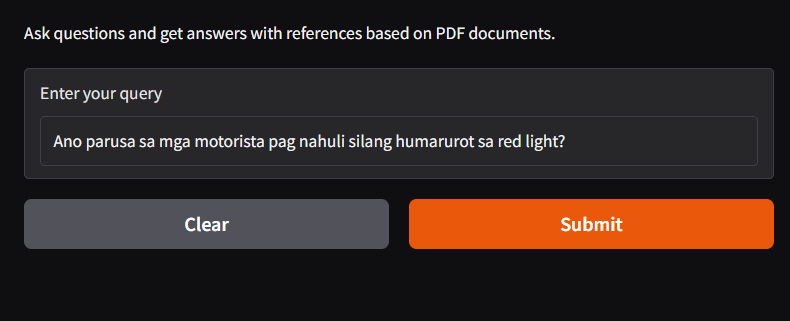
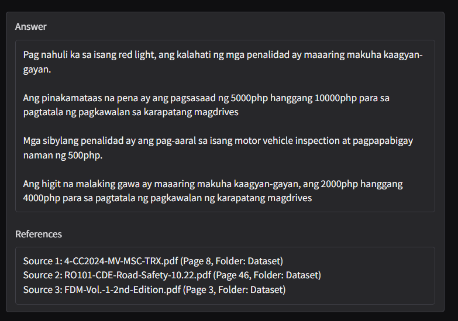

# LTO RAG Chatbot System

A Retrieval-Augmented Generation (RAG) chatbot system designed to answer questions related to LTO (Land Transportation Office) rules, processes, and FAQs. It combines semantic search and generative AI to retrieve relevant information from documents and provide human-like responses.

---

## Features

- **PDF-based Knowledge Base**: Parses official LTO documents into searchable chunks using sentence embeddings.
- **Semantic Search with FAISS**: Retrieves top relevant document chunks based on user queries.
- **Chatbot with GPT**: Uses OpenAI's GPT model to generate answers grounded in retrieved context.
- **Query Transforms**: Reformulates or clarifies user input to improve retrieval accuracy and semantic matching.
- **Gradio Interface**: Simple web interface for conversational interaction.

---

## Tech Stack

- Python
- OCR
- SentenceTransformers (`all-MiniLM-L6-v2`)
- FAISS
- Llama-Index
- OpenAI GPT-3.5 / GPT-4
- Gradio
- PyPDF2

---

